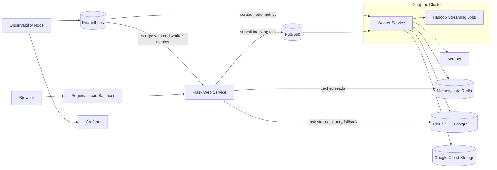

# ScholarMiner

ScholarMiner is a distributed search and indexing system for research papers. The application accepts a Google Scholar results URL, extracts matching IEEE papers and abstracts, builds an inverted index with Hadoop Streaming, and exposes search and Top-N term queries through a Flask web interface.

The current deployment uses a single-region high-availability design: a load-balanced web tier submits asynchronous indexing tasks through Pub/Sub, a separate worker service drives scraping and Dataproc jobs, and managed stateful services handle the cache and durable persistence layers.

## Core Capabilities

- Accepts a Google Scholar results URL from the web application
- Scrapes IEEE paper metadata and abstracts
- Builds and refreshes an inverted index with Hadoop Streaming on Dataproc
- Serves low-latency search and Top-N term queries through Memorystore-backed Redis
- Persists indexed state to Cloud SQL for PostgreSQL and backs up cache state to Google Cloud Storage
- Tracks long-running indexing work through asynchronous task status records
- Exposes Prometheus metrics for the web tier and worker tier, with Grafana auto-provisioned for dashboarding
- Provisions cloud infrastructure with Terraform

## Technology Stack

- Python
- Flask
- Google Pub/Sub
- Hadoop Streaming / Dataproc
- Memorystore for Redis
- Cloud SQL for PostgreSQL
- Prometheus
- Grafana
- Terraform
- Docker
- Google Cloud Platform

## System Architecture



## Engineering Decisions and Design Patterns

### Event-Driven Task Submission

The frontend does not execute long-running scraping or indexing work directly. Instead, it submits indexing tasks to Pub/Sub and tracks progress through task status rows in PostgreSQL. This follows a producer-consumer model while avoiding the fragility of synchronous request/reply messaging for long-running batch work.

### CQRS-Inspired Read/Write Separation

The project uses a practical read/write split:

- Write-heavy operations such as scraping, Hadoop indexing, and index refreshes run asynchronously in the backend worker
- Read-heavy operations such as term lookup and Top-N queries are served directly from Redis whenever possible

This keeps interactive queries fast while isolating the more expensive indexing workflow behind an asynchronous boundary.

### Idempotent Indexing and Duplicate Work Avoidance

To avoid repeating expensive scrape-and-index operations for the same source URL, the worker stores previously processed source URLs in PostgreSQL and mirrors them into Redis when available. Repeated indexing requests can short-circuit early, which reduces unnecessary external API usage and redundant cluster work.

### Polyglot Persistence by Access Pattern

Different storage systems are used for different operational goals:

- Redis handles latency-sensitive reads and ranked term queries
- PostgreSQL stores structured index data durably, including task status and indexed source tracking
- GCS is used as a recovery layer so the worker can restore previously computed state on startup

This is a deliberate trade-off in favor of operational clarity rather than forcing every workload through a single datastore.

### Batch Processing with a Thin Interactive Layer

The heavy computation is pushed into Hadoop Streaming jobs rather than the web process. The Flask application remains a thin orchestration layer, while the backend handles distributed processing, persistence, and cache refreshes. This separation keeps the application easier to reason about and makes performance bottlenecks more explicit.

## Request Flow

1. A user submits a Google Scholar results URL in the Flask application.
2. The app records a task row in PostgreSQL and publishes the indexing request to Pub/Sub.
3. A worker service consumes the task, scrapes paper data, uploads input shards to GCS, and submits a Dataproc job.
4. Hadoop Streaming generates the updated inverted index.
5. The worker persists the latest snapshot to Redis and PostgreSQL, and writes a recovery copy to GCS.
6. Search and Top-N requests are answered from Redis when available, with PostgreSQL used as the durable fallback path.

## Project Layout

- `lightweight-app/`: Flask application, templates, and frontend container assets
- `cluster-app/`: backend worker, scraper, worker container assets, and MapReduce scripts
- `terraform/`: infrastructure definitions for GCP resources
- `utils/`: helper scripts and benchmarking utilities
- `DEPLOYMENT_GUIDE.md`: detailed deployment and operational notes

## End-to-End Setup

The steps below are enough for a new user to clone the repository, deploy the full system, use the web application, and access the observability stack.

### Prerequisites

- A GCP project with billing enabled
- Google Cloud SDK
- Terraform
- Docker with `buildx`
- A container registry you can push to
- A SerpAPI key for Google Scholar scraping

### 1. Clone the Repository

```bash
git clone <your-fork-or-repo-url>
cd ScholarMiner
```

### 2. Authenticate GCP and Docker

```bash
gcloud auth login
gcloud config set project YOUR_PROJECT_ID
gcloud auth application-default login
gcloud auth application-default set-quota-project YOUR_PROJECT_ID
docker login
```

`terraform apply` uses Application Default Credentials for GCP API calls and `docker buildx --push` for the web and worker images, so both GCP auth and container registry auth need to be valid before deploying.

### 3. Configure Terraform Variables

Copy the example file:

```bash
cd terraform
cp terraform.tfvars.example terraform.tfvars
```

Update `terraform.tfvars` with values you control:

- `project_id`
- `region`
- `zone`
- `serpapi_key`
- `frontend_image`
- `worker_image`
- `data_bucket_force_destroy`

`frontend_image` and `worker_image` must point to image tags that your registry account can push to. For Docker Hub, a typical example is:

```tfvars
frontend_image = "yourdockerhubusername/scholarminer-web:latest"
worker_image   = "yourdockerhubusername/scholarminer-worker:latest"
data_bucket_force_destroy = true
```

Set `data_bucket_force_destroy = true` for the default demo workflow where you want `terraform destroy` to remove the versioned data bucket automatically. Set it to `false` if you want Terraform to refuse bucket deletion while indexed data or prior object versions still exist.

### 4. Deploy the Full System

```bash
terraform init
terraform apply -auto-approve
```

This step does all of the following:

- Builds and pushes the frontend image
- Builds and pushes the worker image
- Provisions the regional web tier, worker tier, Dataproc cluster, Cloud SQL, Memorystore, Pub/Sub, GCS, and observability node
- Auto-provisions Grafana datasources and a starter dashboard

Deployment can take several minutes, and the provisioned resources will incur cloud charges until you destroy them.

### 5. Retrieve the URLs and Login Credentials

List all outputs:

```bash
terraform output
```

The most important outputs are:

- `search_engine_url`
- `grafana_dashboard_url`
- `prometheus_url`
- `grafana_admin_password`

You can fetch individual values directly:

```bash
terraform output -raw search_engine_url
terraform output -raw grafana_dashboard_url
terraform output -raw prometheus_url
terraform output -raw grafana_admin_password
```

Grafana login:

- Username: `admin`
- Password: the value from `terraform output -raw grafana_admin_password`

### 6. Run the Application End to End

1. Open `search_engine_url` in your browser.
2. Paste a Google Scholar results URL into the indexing form.
3. Wait for the task status page to move from `PENDING` or `RUNNING` to `COMPLETE`.
4. Use `Search for Term` to query the inverted index.
5. Use `Most Frequent Terms` to view the Top-N term leaderboard.

The intended input is a Google Scholar results page URL, not an IEEE Xplore paper URL directly.

### 7. Use the Observability Stack

After the deployment is up:

1. Open `prometheus_url`.
2. Open `Status -> Targets` and confirm Prometheus is scraping:
   - the web service
   - the worker service
   - the node exporters
3. Open `grafana_dashboard_url`.
4. Log in with `admin` and the generated password.
5. Open the auto-provisioned `ScholarMiner Overview` dashboard.

### 8. Redeploy After Code Changes

If you edit application or Terraform code, rerun:

```bash
cd terraform
terraform apply -auto-approve
```

The current workflow is intentionally ephemeral: apply to stand up the full system, test the changes, then destroy the stack when you are done.

### 9. Destroy the Stack

When you are finished testing:

```bash
cd terraform
terraform destroy -auto-approve
```

If you keep `data_bucket_force_destroy = true`, Terraform will remove the indexed data bucket and its object versions during teardown. If you set it to `false`, empty the bucket manually before destroying the stack.

`google_service_networking_connection.private_service_connection` uses `deletion_policy = "ABANDON"` to avoid a known GCP destroy race where Private Services Access producer subnets can outlive Cloud SQL or Memorystore deletion. This means `terraform destroy` can intentionally leave the PSA connection and allocated range behind if Google has not fully released them yet.

If you are updating an existing deployment that predates this workaround, run the following once before destroying so Terraform records the policy in state without recreating the full stack:

```bash
cd terraform
terraform apply -target=google_service_networking_connection.private_service_connection -auto-approve
```

### Local Frontend Only

`lightweight-app/.env` is only for running the Flask frontend outside the Terraform-managed deployment. A full cloud deployment does not depend on that file.

### Troubleshooting

- If `terraform apply` fails on `google_service_networking_connection.private_service_connection` with an authentication error, rerun the `gcloud auth login` and `gcloud auth application-default login` commands above, then run `terraform apply` again.
- If Grafana is up but you cannot log in, fetch the password again with `terraform output -raw grafana_admin_password`.
- If the task status page stays in `RUNNING` for too long, check the worker instances and Dataproc cluster in GCP.
- If Prometheus is up but targets are missing, verify that the web and worker managed instance groups are healthy and that the instances are running.

## License

This project is licensed under the GNU Affero General Public License v3. See `LICENSE` for details.
