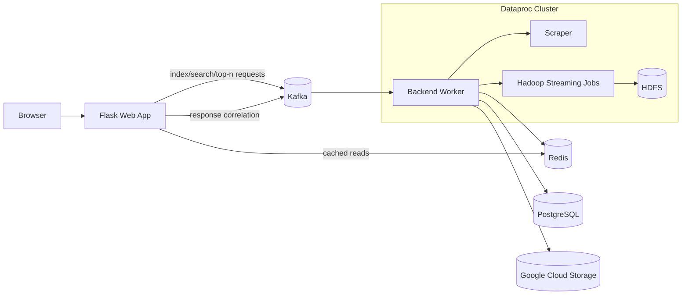

# ScholarMiner

ScholarMiner is a distributed search and indexing system for research papers. The application accepts a Google Scholar results URL, extracts matching IEEE papers and abstracts, builds an inverted index with Hadoop Streaming, and exposes search and Top-N term queries through a Flask web interface.

The system pairs a lightweight user-facing application with an asynchronous processing pipeline so that interactive requests remain simple while indexing and scraping work can run independently.

## Core Capabilities

- Accepts a Google Scholar results URL from the web application
- Scrapes IEEE paper metadata and abstracts
- Builds and refreshes an inverted index with Hadoop Streaming on Dataproc
- Serves low-latency search and Top-N term queries through Redis
- Persists indexed state to PostgreSQL and backs up cache state to Google Cloud Storage
- Provisions cloud infrastructure with Terraform

## Technology Stack

- Python
- Flask
- Apache Kafka
- Hadoop Streaming / Dataproc
- Redis
- PostgreSQL
- Terraform
- Docker
- Google Cloud Platform

## System Architecture



## Engineering Decisions and Design Patterns

### Event-Driven Request Processing

The frontend does not execute long-running scraping or indexing work directly. Instead, it publishes requests to Kafka and waits for a correlated response using a generated `request_id`. This follows a producer-consumer model with a correlation ID pattern for request tracking. It decouples the web layer from the data-processing layer and keeps the UI responsive even when indexing work is expensive.

### CQRS-Inspired Read/Write Separation

The project uses a practical read/write split:

- Write-heavy operations such as scraping, Hadoop indexing, and index refreshes run asynchronously in the backend worker
- Read-heavy operations such as term lookup and Top-N queries are served directly from Redis whenever possible

This keeps interactive queries fast while isolating the more expensive indexing workflow behind an asynchronous boundary.

### Idempotent Indexing and Duplicate Work Avoidance

To avoid repeating expensive scrape-and-index operations for the same source URL, the backend stores previously processed URLs in Redis. Repeated indexing requests can short-circuit early, which reduces unnecessary external API usage and redundant cluster work.

### Polyglot Persistence by Access Pattern

Different storage systems are used for different operational goals:

- Redis handles latency-sensitive reads and ranked term queries
- PostgreSQL stores structured index data durably
- GCS is used as a recovery layer so the worker can restore previously computed state on startup

This is a deliberate trade-off in favor of operational clarity rather than forcing every workload through a single datastore.

### Batch Processing with a Thin Interactive Layer

The heavy computation is pushed into Hadoop Streaming jobs rather than the web process. The Flask application remains a thin orchestration layer, while the backend handles distributed processing, persistence, and cache refreshes. This separation keeps the application easier to reason about and makes performance bottlenecks more explicit.

## Request Flow

1. A user submits a Google Scholar results URL in the Flask application.
2. The app publishes an indexing request to Kafka.
3. The backend worker scrapes paper data and writes TSV input into HDFS.
4. Hadoop Streaming generates the inverted index.
5. The backend persists the results to Redis and PostgreSQL, and writes a recovery copy to GCS.
6. Search and Top-N requests are answered from Redis when available, with backend processing used as a fallback path.

## Project Layout

- `lightweight-app/`: Flask application, templates, and frontend container assets
- `cluster-app/`: backend worker, scraper, Kafka utilities, and MapReduce scripts
- `terraform/`: infrastructure definitions for GCP resources
- `utils/`: helper scripts and benchmarking utilities
- `DEPLOYMENT_GUIDE.md`: detailed deployment and operational notes

## Running the Frontend Locally

The primary workflow for this project is a GCP-backed deployment. For local frontend testing, the Flask app can still be built and run from `lightweight-app/`, but the full system expects Kafka, Redis, and the backend worker to be available in the deployed environment.

If you want to run the frontend locally, configure the required environment variables in `lightweight-app/.env` so it can reach the deployed services.

## Deploying to GCP

1. Copy the Terraform variables file:

```bash
cd terraform
cp terraform.tfvars.example terraform.tfvars
```

2. Fill in `project_id`, `region`, `zone`, and `serpapi_key`.

3. Provision the infrastructure:

```bash
terraform init
terraform apply -auto-approve
```

Terraform outputs the service URLs and internal infrastructure details used by the rest of the system. For the full deployment walkthrough, including backend worker setup and verification steps, see `DEPLOYMENT_GUIDE.md`.

## License

This project is licensed under the GNU Affero General Public License v3. See `LICENSE` for details.
